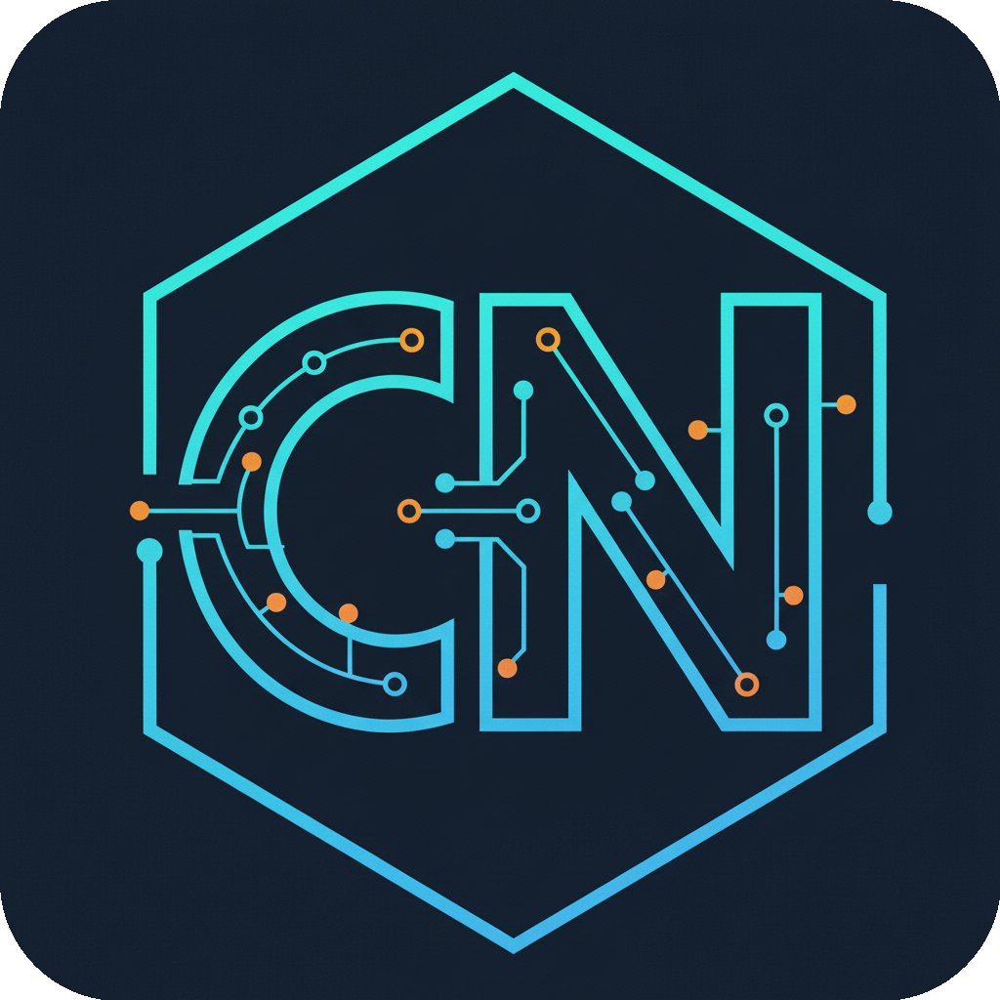

<p align="center">
  
</p>

<h1 align="center">🏛️ NomadArch</h1>

<h3 align="center">Advanced AI Coding Workspace</h3>

<p align="center">
  <em>Fork by CodeNomad — now with GLM 4.7, multi-model support, and MULTIX Mode</em>
</p>

<p align="center">
  <a href="https://github.com/roman-ryzenadvanced/NomadArch-v1.0/stargazers">
    
  </a>
  <a href="https://github.com/roman-ryzenadvanced/NomadArch-v1.0/network/members">
    
  </a>
  <a href="https://github.com/roman-ryzenadvanced/NomadArch-v1.0/blob/main/LICENSE">
    
  </a>
</p>

<p align="center">
  <a href="#-features">Features</a> •
  <a href="#-supported-ai-models">AI Models</a> •
  <a href="#-installation">Installation</a> •
  <a href="#-usage">Usage</a> •
  <a href="#-whats-new">What's New</a> •
  <a href="#-credits">Credits</a>
</p>

<p align="center">
  <a href="https://github.com/roman-ryzenadvanced/NomadArch-v1.0">
    
  </a>
</p>

---

## 🎯 Overview

**NomadArch** is an enhanced fork of CodeNomad by OpenCode, featuring significant UI/UX improvements, additional AI integrations, and a more robust architecture. This is a full-featured AI coding assistant with support for multiple AI providers including **GLM 4.7**, Anthropic, OpenAI, Google, Qwen, and local models via Ollama.

### ✨ Key Improvements Over CodeNomad
- 🔧 Fixed Qwen OAuth authentication flow
- 🚀 Enhanced MULTIX Mode with live token streaming
- 🎨 Improved UI/UX with detailed tooltips
- ✅ Auto-build verification on launch
- 📦 Comprehensive installer scripts for all platforms
- 🔌 Port conflict detection and resolution hints

---

## 🤖 Supported AI Models

NomadArch supports a wide range of AI models from multiple providers, giving you flexibility to choose the best model for your coding tasks.

### 🔥 Featured Model: GLM 4.7 (Z.AI)

**GLM 4.7** is the latest state-of-the-art open model from Z.AI, now fully integrated into NomadArch. Released in December 2025, GLM 4.7 ranks **#1 for Web Development** and **#6 overall** on the LM Arena leaderboard.

| Feature | Description |
|---------|-------------|
| 📊 **128K Context Window** | Process entire codebases in a single session |
| 🧠 **Interleaved Thinking** | Advanced reasoning with multi-step analysis |
| 💭 **Preserved Thinking** | Maintains reasoning chain across long conversations |
| 🔄 **Turn-level Thinking** | Optimized per-response reasoning for efficiency |

#### Benchmark Performance

| Benchmark | Score | Notes |
|-----------|-------|-------|
| SWE-bench | **+73.8%** | Over GLM-4.6 |
| SWE-bench Multilingual | **+66.7%** | Over GLM-4.6 |
| Terminal Bench 2.0 | **+41%** | Over GLM-4.6 |
| LM Arena WebDev | **#1** | Open Model Ranking |
| LM Arena Overall | **#6** | Open Model Ranking |

> 🎯 **Get 10% discount on Z.AI with code: [`R0K78RJKNW`](https://z.ai/subscribe?ic=R0K78RJKNW)**

---

### 📋 All Supported Models

<details>
<summary><b>🌟 Z.AI Models</b></summary>

| Model | Context | Specialty |
|-------|---------|-----------|
| **GLM 4.7** | 128K | Web Development, Coding |
| GLM 4.6 | 128K | General Coding |
| GLM-4 | 128K | Versatile |

</details>

<details>
<summary><b>🟣 Anthropic Models</b></summary>

| Model | Context | Specialty |
|-------|---------|-----------|
| Claude 3.7 Sonnet | 200K | Complex Reasoning |
| Claude 3.5 Sonnet | 200K | Balanced Performance |
| Claude 3 Opus | 200K | Maximum Quality |

</details>

<details>
<summary><b>🟢 OpenAI Models</b></summary>

| Model | Context | Specialty |
|-------|---------|-----------|
| GPT-5 Preview | 200K | Latest Capabilities |
| GPT-4.1 | 128K | Production Ready |
| GPT-4 Turbo | 128K | Fast & Efficient |

</details>

<details>
<summary><b>🔵 Google Models</b></summary>

| Model | Context | Specialty |
|-------|---------|-----------|
| Gemini 2.0 Pro | 1M+ | Massive Context |
| Gemini 2.0 Flash | 1M+ | Ultra Fast |

</details>

<details>
<summary><b>🟠 Qwen & Local Models</b></summary>

| Model | Context/Size | Specialty |
|-------|--------------|-----------|
| Qwen 2.5 Coder | 32K | Code Specialized |
| Qwen 2.5 | 32K | General Purpose |
| DeepSeek Coder (Ollama) | Varies | Code |
| Llama 3.1 (Ollama) | Varies | General |

</details>

---

## 📦 Installation

### Quick Start (Recommended)

#### Windows
```batch
Install-Windows.bat
Launch-Windows.bat
```

#### Linux
```bash
chmod +x Install-Linux.sh && ./Install-Linux.sh
./Launch-Unix.sh
```

#### macOS
```bash
chmod +x Install-Mac.sh && ./Install-Mac.sh
./Launch-Unix.sh
```

### Manual Installation

```bash
git clone https://github.com/roman-ryzenadvanced/NomadArch-v1.0.git
cd NomadArch
npm install
npm run dev:electron
```

---

## 🚀 Features

### Core Features
| Feature | Description |
|---------|-------------|
| 🤖 **Multi-Provider AI** | GLM 4.7, Anthropic, OpenAI, Google, Qwen, Ollama |
| 🖥️ **Electron Desktop App** | Native feel with modern web technologies |
| 📁 **Workspace Management** | Organize your projects efficiently |
| 💬 **Real-time Streaming** | Live responses from AI models |
| 🔧 **Smart Fix** | AI-powered code error detection and fixes |
| 🔌 **Ollama Integration** | Run local AI models for privacy |

### UI/UX Highlights
| Mode | Description |
|------|-------------|
| ⚡ **MULTIX Mode** | Multi-task parallel AI conversations with live token counting |
| 🛡️ **SHIELD Mode** | Auto-approval for hands-free operation |
| 🚀 **APEX Mode** | Autonomous AI that chains tasks together |

---

## 🆕 What's New

<details>
<summary><b>🎨 Branding & Identity</b></summary>

- ✅ **New Branding**: "NomadArch" with proper attribution to OpenCode
- ✅ **Updated Loading Screen**: New branding with fork attribution
- ✅ **Updated Empty States**: All screens show NomadArch branding

</details>

<details>
<summary><b>🔐 Qwen OAuth Integration</b></summary>

- ✅ **Fixed OAuth Flow**: Resolved "Body cannot be empty" error
- ✅ **Proper API Bodies**: POST requests now include proper JSON bodies
- ✅ **Fixed Device Poll Schema**: Corrected Fastify schema validation

</details>

<details>
<summary><b>🚀 MULTIX Mode Enhancements</b></summary>

- ✅ **Live Streaming Token Counter**: Visible in header during AI processing
- ✅ **Thinking Roller Indicator**: Animated indicator with bouncing dots
- ✅ **Token Stats Display**: Shows input/output tokens processed
- ✅ **Auto-Scroll**: Intelligent scrolling during streaming

</details>

<details>
<summary><b>🐛 Bug Fixes</b></summary>

- ✅ Fixed Qwen OAuth "empty body" errors
- ✅ Fixed MultiX panel being pushed off screen
- ✅ Fixed top menu/toolbar disappearing
- ✅ Fixed layout breaking when scrolling
- ✅ Fixed sessions not showing on workspace entry

</details>

---

## 🎮 Button Guide

| Button | Description |
|--------|-------------|
| **AUTHED** | Shows authentication status (Green = connected) |
| **AI MODEL** | Click to switch between AI models |
| **SMART FIX** | AI analyzes code for errors and applies fixes |
| **BUILD** | Compiles and builds your project |
| **APEX** | Autonomous mode - AI chains actions automatically |
| **SHIELD** | Auto-approval mode - AI makes changes without prompts |
| **MULTIX MODE** | Opens multi-task pipeline for parallel conversations |

---

## 📁 Project Structure

```
NomadArch/
├── Install-*.bat/.sh      # Platform installers
├── Launch-*.bat/.sh       # Platform launchers
├── packages/
│   ├── electron-app/      # Electron main process
│   ├── server/            # Backend (Fastify)
│   ├── ui/                # Frontend (SolidJS + Vite)
│   └── opencode-config/   # OpenCode configuration
└── README.md
```

---

## 🔧 Requirements

| Requirement | Version |
|-------------|---------|
| Node.js | v18+ |
| npm | v9+ |
| OS | Windows 10+, macOS 11+, Linux |

---

## 🆘 Troubleshooting

<details>
<summary><b>Common Issues & Solutions</b></summary>

**Dependencies not installed?**
```bash
# Run the installer for your platform
Install-Windows.bat  # Windows
./Install-Linux.sh   # Linux
./Install-Mac.sh     # macOS
```

**Port conflict?**
```bash
# Kill process on port 3000/3001
taskkill /F /PID <PID>  # Windows
kill -9 <PID>           # Unix
```

**OAuth fails?**
1. Check internet connection
2. Complete OAuth in browser
3. Clear browser cookies and retry

</details>

---

## 🙏 Credits

Built with amazing open source projects:

| Category | Projects |
|----------|----------|
| **Framework** | SolidJS, Vite, TypeScript, Electron |
| **UI** | TailwindCSS, Kobalte, SUID Material |
| **Backend** | Fastify, Ollama |
| **AI** | OpenCode CLI, Various AI SDKs |

---

## 📄 License

This project is a fork of [CodeNomad by OpenCode](https://github.com/opencode/codenom).

---

<p align="center">
  Made with ❤️ by <a href="https://github.com/NeuralNomadsAI">NeuralNomadsAI</a>
</p>

<p align="center">
  <sub>Fork by CodeNomad</sub>
</p>
